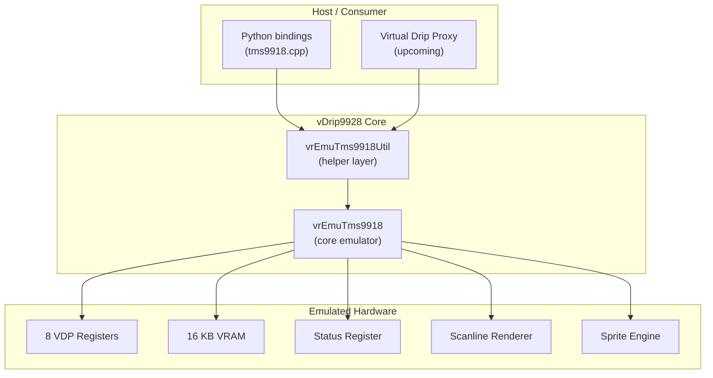
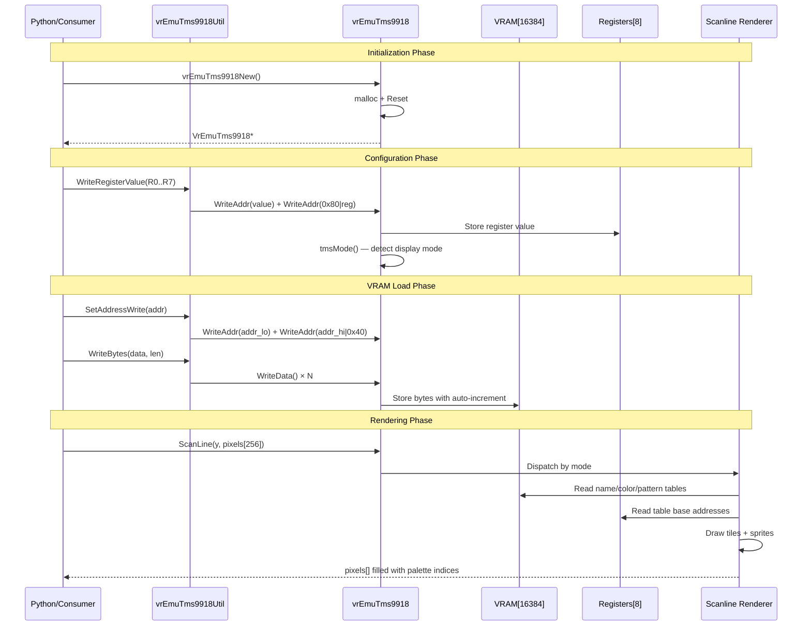

# Architecture

## System Overview

vDrip9928 is a **software emulation of the TMS9918 VDP** — a classic video display processor chip used in MSX, ColecoVision, TI-99/4A, and other 1980s systems. It emulates the VDP at the register/VRAM interface level and renders pixel output scanline-by-scanline via a callback-free API.

## Layered Architecture

### Layer 1: Core Emulator (`vrEmuTms9918.c/.h`)

The heart of the system. Written in pure C99 with zero dependencies. Responsible for:

- **Register file**: 8 write-only VDP registers (R0–R7)
- **Status register**: Read-only, provides interrupt flag, 5th-sprite flag, sprite collision flag, and 5th-sprite number
- **VRAM**: 16 KB byte array (`uint8_t vram[16384]`) with auto-incrementing address pointer
- **Address/Data port protocol**: Two-stage write cycle emulating the real VDP's `MODE` pin (address vs. data)
- **Read-ahead buffer**: Emulates the real VDP's read-before-write behavior
- **Mode detection**: Automatic mode determination from register bits (Graphics II takes priority over M1/M2/M3 bits)
- **Scanline rendering**: Four mode-specific scanline generators that produce palette-index output
- **Sprite engine**: 32-sprite scan with 4-per-scanline limit, 5th-sprite detection, collision detection, magnification, 8×8/16×16 support, early clock

### Layer 2: Utility Library (`vrEmuTms9918Util.c/.h`)

Convenience wrappers over the core API. Provides:

- **Register write helpers**: Single-call register writes (composes two `WriteAddr` calls)
- **VRAM address setup**: `SetAddressRead()` and `SetAddressWrite()` helpers
- **Bulk VRAM writes**: `WriteBytes()`, `WriteByteRpt()`, `WriteString()`, `WriteStringOffset()`
- **Table address setters**: `SetNameTableAddr()`, `SetColorTableAddr()`, `SetPatternTableAddr()`, `SetSpriteAttrTableAddr()`, `SetSpritePattTableAddr()`
- **Color helpers**: `FgBgColor()` for composing color bytes, `SetFgBgColor()`
- **Mode initializers**: `InitialiseGfxI()`, `InitialiseGfxII()` — configure all registers and clear VRAM for a given mode
- **Palette**: `vrEmuTms9918Palette[]` — 16-entry RGBA palette array

### Layer 3: Python Bindings (`pybindings/tms9918.cpp`)

A pybind11 wrapper around the C library, compiled as a Python extension module. Exposes a `Tms9918` class with:

- `setReg(reg, val)` — write a single register
- `setRegs(list)` — write all 8 registers at once
- `setVram(addr, data)` — write bytes to VRAM at a given address
- `getScreen()` — render the full 256×192 framebuffer as an RGB byte array

## Data Flow

## VDP Register Map

| Register | Alias | Purpose |
|----------|-------|---------|
| R0 | — | Mode bits, external VDP enable |
| R1 | — | 16K/4K RAM, display enable, interrupt enable, mode bits, sprite size, sprite mag |
| R2 | Name Table | Name table base address (`addr >> 10`) |
| R3 | Color Table | Color table base address (`addr >> 6`) |
| R4 | Pattern Table | Pattern/generator table base address (`addr >> 11`) |
| R5 | Sprite Attr Table | Sprite attribute table base address (`addr >> 7`) |
| R6 | Sprite Patt Table | Sprite pattern table base address (`addr >> 11`) |
| R7 | FG/BG Color | Foreground color (Text mode) and background color (all modes) |

## Status Register Bits

| Bit | Mask | Meaning |
|-----|------|---------|
| 7 | `0x80` | **INT** — VSYNC interrupt flag (set at last scanline if interrupts enabled) |
| 6 | `0x40` | **5S** — 5th sprite flag (more than 4 sprites on a scanline) |
| 5 | `0x20` | **CO** — Sprite collision (two non-transparent sprite pixels overlap) |
| 4–0 | `0x1F` | **5th sprite number** — index of the 5th sprite on a scanline |
