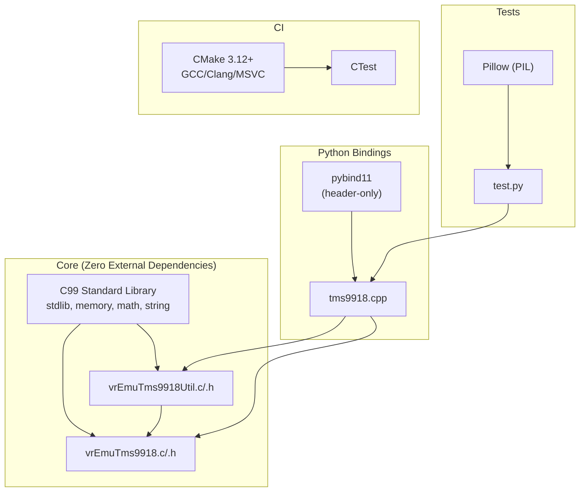

# Dependencies

## Dependency Graph



## Detailed Breakdown

### Build-Time Dependencies

| Dependency | Version | Type | Required For |
|------------|---------|------|-------------|
| CMake | ≥ 3.12 | Build system | Primary build |
| C compiler (GCC/Clang/MSVC) | Any C99-capable | Compiler | Core library |
| C++ compiler | C++11-capable | Compiler | Python bindings only |
| pybind11 | Any | Header-only library | Python bindings only |

### Run-Time Dependencies (Core)

**None.** The core `libvrEmuTms9918.so` library has zero runtime dependencies beyond the system C library. It can be used as a shared library, statically linked, or compiled directly into firmware (PICO9918 use case).

### Run-Time Dependencies (Python Bindings)

| Dependency | Version | Type |
|------------|---------|------|
| Python 3 | 3.x | Interpreter |
| pybind11 | Any (installed) | Python module |
| Pillow | Any (installed) | Test display only |

### Standard Library Usage

The core library uses only four standard C headers:

| Header | Usage |
|--------|-------|
| `stdlib.h` | `malloc`, `free` |
| `memory.h` | `memset` |
| `math.h` | (included but no functions currently used — likely vestigial) |
| `string.h` | `memset`, `strlen` (utility layer) |

Note: `memory.h` is a non-standard header on some platforms (the standard is `string.h` for `memset`). This may cause portability issues on strict C99 implementations. The code includes both `memory.h` and `string.h`.

### PICO9918 (Raspberry Pi Pico) Dependencies

When compiled with `PICO_BUILD`:
- Requires `pico/stdlib.h`
- Changes `inline` semantics to `__force_inline`
- Wraps time-critical functions with `__time_critical_func()` macro

### WebAssembly (Emscripten) Dependencies

When compiled with `__EMSCRIPTEN__`:
- Requires `<emscripten.h>`
- Uses `EMSCRIPTEN_KEEPALIVE` attribute on exports
- All exports remain `extern "C"`

### Repository Origin

```
Remote: https://github.com/visrealm/vrEmuTms9918.git
Branch: main
HEAD:  dc40960 ("Fixed linux build for pi pico")
```

The upstream repository is maintained by Troy Schrapel (visrealm). The vDrip9928 working copy includes local additions (Python bindings, test data) not present upstream.
