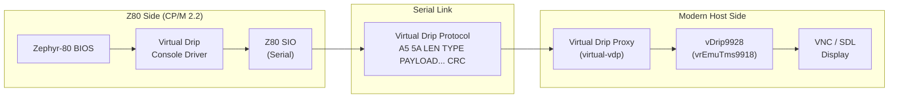

# Integration Context — vDrip9928 in the Zephyr-80 System

## Where vDrip9928 Fits

vDrip9928 is the **display rendering side** of the Virtual Drip console subsystem. In the Zephyr-80 architecture, the TMS9918 display pipeline is split across two machines:



## Virtual Drip Protocol Context

The Virtual Drip protocol uses packet framing:
```
A5 5A LEN TYPE PAYLOAD... CRC
```

Relevant to vDrip9928:
- **VDP Register packets**: Carry TMS9918 register writes from the Z80 to the host
- **VRAM packets**: Carry VRAM data writes from the Z80 to the host
- **Cursor/control packets**: Display control commands

The proxy (`VirtualDrip/virtual-vdp`) receives these packets, decodes them, and calls into vDrip9928's API to update VDP state and render frames.

## Workspace Relationship

```
Z80HomeBrew/Code/
├── HOST/
│   ├── CPM2.2/          ← Z80 CP/M 2.2 with Zephyr-80 BIOS
│   │   └── src/         ← BIOS includes Virtual Drip console driver
│   ├── Monitor/         ← Z80 monitor (standalone test harness)
│   └── HelloWorld/      ← Test programs (echo, mandelbrot, etc.)
│
├── MODERN/
│   └── VirtualDrip/     ← Virtual Drip proxy (C++), receives packets,
│                           drives vDrip9928 for display rendering
│
└── vDrip9928/           ← **THIS PROJECT** — TMS9918 emulator library
    └── pybindings/      ← Python bindings for testing/scripting
```

## Data Flow: Z80 → Display

1. **Z80 CP/M program** writes to TMS9918 ports (via BIOS `CONOUT` or direct I/O)
2. **Virtual Drip Console Driver** captures VDP writes, packetizes them
3. **Z80 SIO** transmits packets over serial
4. **Virtual Drip Proxy** (`VirtualDrip/virtual-vdp`) receives packets
5. Proxy calls **vDrip9928** API: `WriteAddr`, `WriteData`, `WriteRegValue`, etc.
6. Proxy calls `ScanLine` × 192 to generate framebuffer
7. Framebuffer is sent to display (VNC, SDL, etc.)

## Key Integration Points

### 1. Register Synchronization
The Z80 side can modify VDP registers at any time. The proxy must forward these changes to vDrip9928 via `WriteRegValue()` or the two-stage `WriteAddr()` protocol. Mode changes (e.g., Graphics I → Text) are detected automatically by vDrip9928.

### 2. VRAM Synchronization
VRAM writes from the Z80 arrive as packet payloads. The proxy calls `SetAddressWrite()` + `WriteBytes()` to load them into the emulated VRAM.

### 3. Frame Rendering
The proxy renders frames on demand (typically at a fixed rate, not tied to Z80 timing). It calls `ScanLine(y, buffer)` for y = 0 to 191, composites the palette-index output into an RGB framebuffer, and pushes to the display.

### 4. Status Register
The Z80 may read the VDP status register (for VSYNC interrupt, sprite collision, 5th sprite). The proxy calls `ReadStatus()` and sends the result back over Virtual Drip to the Z80.

## Constraints from AGENTS.md (CPM2.2 Workspace)

From the CPM2.2 workspace rules, vDrip9928 must respect:

| Rule | Impact |
|------|--------|
| Virtual Drip packet framing (`A5 5A...`) | Do not change packet types or CRC |
| Do not modify vrEmuTms9918 internals from BIOS tasks | vDrip9928 is the canonical emulator, BIOS must not work around it |
| Console input ≠ console output | The proxy must not mix keyboard handling with display rendering |
| RTS/CTS flow control | Proxy should gate rendering during keyboard input bursts |
| Proxy READY handshake | Start-up synchronization must be preserved |

## Future Considerations

- The Python bindings provide a lightweight way to test VDP state without the full proxy
- The `image.bin` file format (VRAM + registers blob) could become a snapshot/restore format
- The emulator's scanline API is callback-free — the caller controls rendering timing, which suits the proxy's batching discipline
- Potential integration with `vrEmuTms9918InitialiseGfxI/GfxII` for mode transitions triggered by CP/M programs
