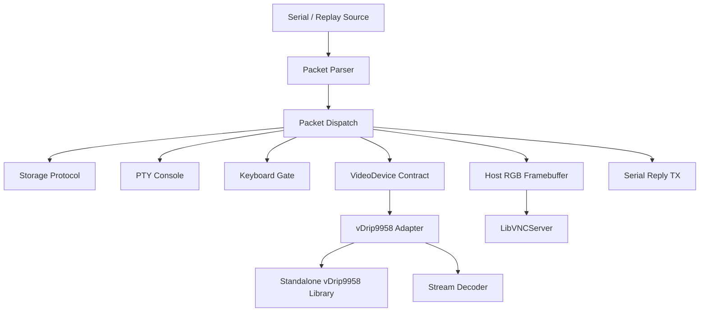
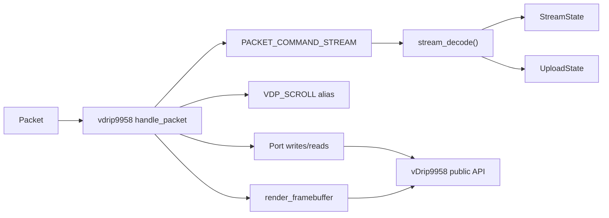

# Virtual Drip Architecture

## System Overview

Virtual Drip is a single native C11 process with five major boundaries:

1. **Packet sources**: serial port (live Zephyr-80 link) or file replay
2. **Protocol parsing**: streaming frame decoder producing complete packets
3. **Packet dispatch**: central coordinator routing to services and video backend
4. **Video device**: production V9958 adapter behind the stable device contract
5. **Display**: LibVNCServer over a host-owned 32-bit RGB framebuffer



Text: packets arrive from serial or replay, are parsed into whole frames,
dispatched to storage/PTY/keyboard services or the selected video backend.
The V9958 adapter owns one emulator instance and a stream decoder. The
dispatch layer owns reply serialization and presentation notification.

## Threading and Serialization

- **Main thread**: packet dispatch, video rendering (under framebuffer mutex)
- **Serial reader thread**: reads bytes, feeds parser, invokes dispatch callback
- **Keyboard writer thread**: dequeues input bytes, sends via serial TX mutex
- **PTY reader thread** (optional): reads PTY master, sends `TERMINAL_RX` packets

Serial TX is protected by a mutex (`SerialPort::tx_mutex`). The framebuffer
is protected by a separate mutex. Storage replies are paced (inter-byte
delay) to avoid overwhelming the Z80 RX path.

## Data Flow

### Ingress (Zephyr → Proxy)

```
Serial bytes → packet_parser_feed() → complete Packet → packet_dispatch_handle_packet()
                                                                  ├── storage_protocol_handle_packet()
                                                                  ├── pty_console_handle_packet()
                                                                  ├── FRAME_MARK → frame_mark() + render
                                                                  ├── CURSOR_COMMAND → cursor overlay
                                                                  ├── PACKET_RESET → emulator + state reset
                                                                  ├── PACKET_COMMAND_STREAM → stream_decode()
                                                                  └── video_device_handle_packet()
```

### Egress (Proxy → Zephyr)

```
video_device_handle_packet() → VideoDeviceResult.reply_kind
                              → dispatch_send_reply()
                              → serial_port_send_packet()
                              → [TX mutex] → serial fd
```

### Presentation

```
result.framebuffer_dirty || result.presentation_requested
    → video_device_render_framebuffer()
    → [optional: virtual_text_cursor_render_overlay()]
    → frame_changed callback → VNC dirty notification
```

## State Ownership

| State | Owner |
|---|---|
| Parser state + partial frame | `PacketParser` |
| Decoded `Packet` | Parser callback lifetime |
| Serial fd + TX mutex | `SerialPort` |
| Storage transaction + image | Storage service |
| Keyboard queue + traffic gate | `KeyboardTransport` |
| Host framebuffer + mutex | `main.c` |
| VNC screen | `DisplayLibVncServer` |
| `VideoDevice` handle + vtable | Dispatch (borrowed) |
| V9958 emulator instance | V9958 adapter (`VideoDevice::impl`) |
| Stream retained state + upload state | `PacketDispatch` |
| FRAME_MARK / PACKET_RESET behavior | Dispatch layer |

## Dependency Direction

```
protocol.h  ←  packet_parser  ←  packet_dispatch  →  video_device
                serial_port                            ↑
                storage_protocol                       |
                pty_console                    concrete adapters
                keyboard_transport
```

Concrete adapters depend on their emulator library (e.g., `vDrip9958.h`) and
`video_device.h`. They do NOT depend on dispatch, serial, VNC, or protocol
framing. The dispatch layer owns reply encoding and VNC notification.

## Backend Selection

```c
// main.c
VideoDevice *create_video_backend(const char *name) {
    if ("vdrip9958") return video_device_vdrip9958_create();
    return NULL;
}
```

`vdrip9958` is the only accepted backend value. The framebuffer is allocated to
the backend's advertised `info.width × info.height`.

## V9958 Adapter Architecture



Text: low-level port operations go directly to the emulator. Command streams
are decoded by `stream_decode()` in `protocol.c`, which updates retained
state and the upload state machine. The decoder currently stubs out
emulator-specific rendering — cell operations and bitmap rendering are
defined in the functional design but deferred in the implementation.

---

*Derived from source at `src/`, `backends/vDrip9958/src/`. Verified 2026-06-20.*
